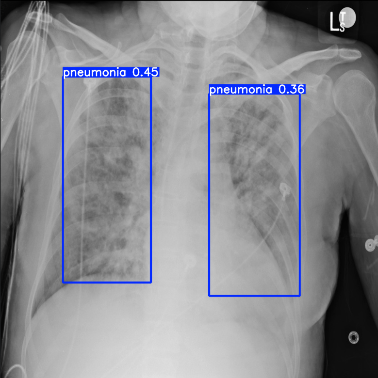

```markdown
# 🫁 Pneumonia Detection from Chest X-Ray Images

This project implements a **deep learning model** to detect **pneumonia** from chest X-ray images. It is intended for research and educational purposes.

---



## 📌 Project Goal

The main goal of this project is to create a model that classifies **normal** and **pneumonia** conditions using a **Convolutional Neural Network (CNN)**. The model can automatically analyze X-ray images and identify the presence of pneumonia, which can serve as a supportive tool in medical diagnostics.

---

## 📁 Project Structure

The repository contains the following files:

```

📦 pneumonia-detection
┣ 📜 Pneumonia_detection.ipynb
┣ 📜 project.zip
┗ 📁 (other supporting files, dataset not included)

````

- **Pneumonia_detection.ipynb** – main Jupyter Notebook containing data preprocessing, model training, and evaluation.  
- **project.zip** – may include additional scripts or resources.

---

## 🛠️ Getting Started

To clone the repository:

```bash
git clone https://github.com/vusalamusayeva/pneumonia-detection.git
cd pneumonia-detection
````

---

## 📦 Requirements

Install the necessary Python packages:

```bash
pip install numpy pandas matplotlib tensorflow keras scikit-learn jupyter
```

These libraries are required for **data preprocessing, CNN model training, and evaluation**.

---

## ▶️ Usage

1. Open the Jupyter Notebook:

```bash
jupyter notebook Pneumonia_detection.ipynb
```

2. Follow these steps inside the Notebook:

   * Load and preprocess the dataset
   * Build the CNN model
   * Train and evaluate the model

> **Note:** The dataset is not included in this repository. You can download the **Chest X-Ray Pneumonia Dataset** from Kaggle or other sources.

---

## 📊 Results

The Notebook includes model accuracy metrics, classification reports, and visualization of training performance.

---

## 🤝 Contributing

To contribute:

1. Fork the repository.
2. Create a new branch (`git checkout -b feature-name`).
3. Commit your changes (`git commit -m "Add new feature"`).
4. Push to the branch (`git push origin feature-name`).
5. Open a Pull Request.

---

## 📜 License

This project does not include a license by default. If you want to use, share, or modify it, consider adding a license (e.g., MIT, Apache-2.0).

---

## 🧠 Disclaimer

This project is **for research and educational purposes only**. It is **not a medical diagnostic tool**. Always consult a medical professional for diagnosis.

```

---

```
